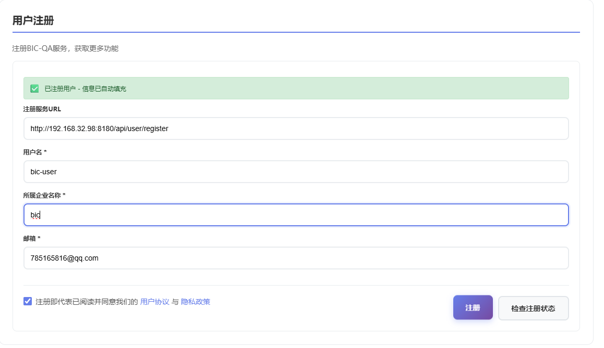
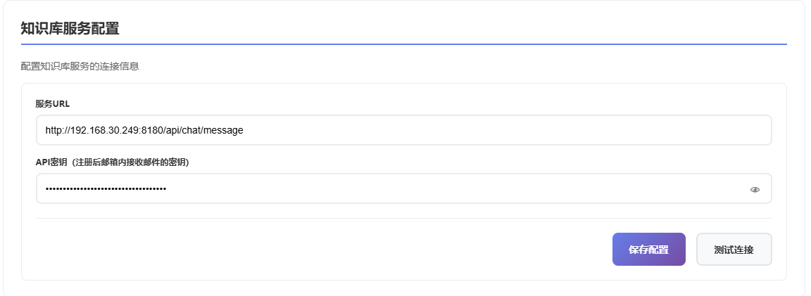
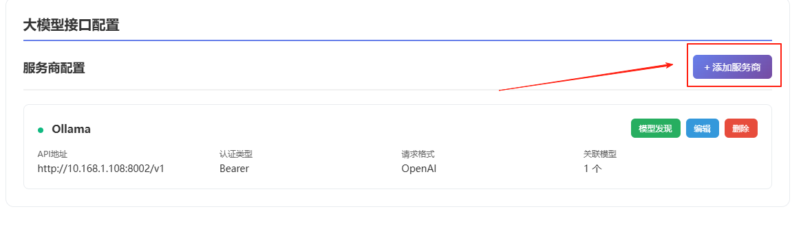
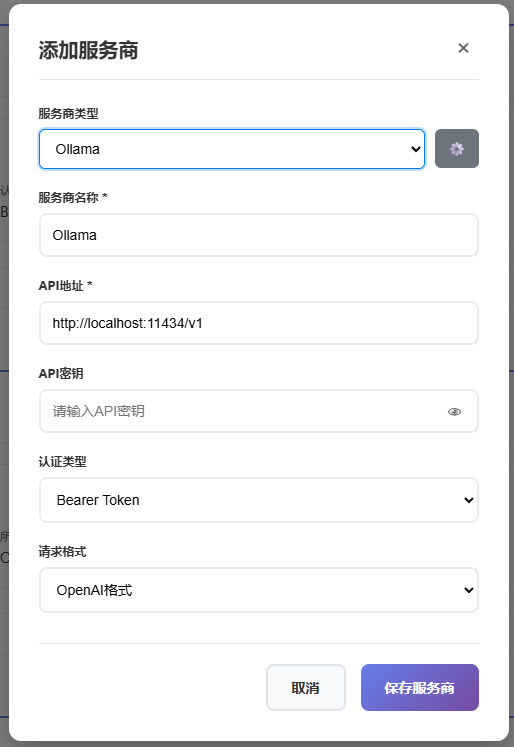
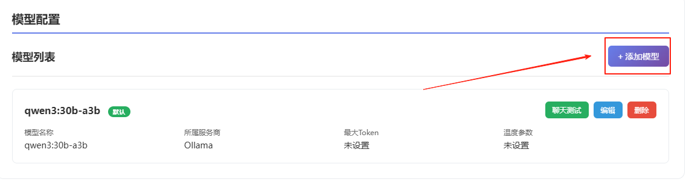
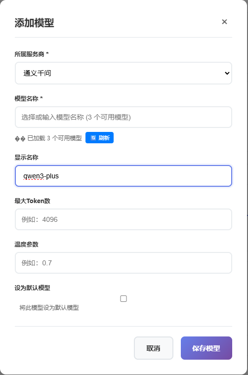
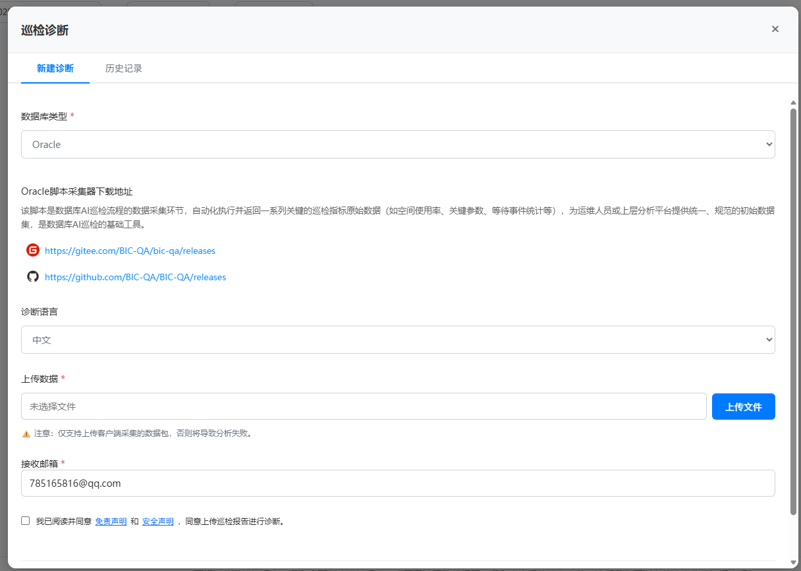

# DBAIOps

<p align="center">
  📄 Official repository for the VLDB 2026 paper
</p>

<p align="center">
  <a href="https://www.vldb.org/pvldb/vol19/p1319-zhou.pdf"><strong>DBAIOps: A Reasoning LLM-Enhanced Database Operation and Maintenance System using Knowledge Graphs</strong></a>
</p>

<p align="center">
  🚀 Browser-based assistant for knowledge-grounded Q&A, AWR report analysis, inspection review, and SQL optimization.
</p>

<p align="center">
  
  
  
  
  
</p>

<p align="center">
  <a href="#2-quick-start">Quick Start</a> •
  <a href="#project-introduction">Project Introduction</a> •
  <a href="#3-analysis-features">Analysis Features</a> •
  <a href="#4-operational-notes">Operational Notes</a> •
  <a href="#upstream-acknowledgement">Upstream Acknowledgement</a>
</p>

<p align="center">
  <strong>English</strong> | <a href="./README_ZH.md">简体中文</a>
</p>

<p align="center">
  ⭐ Star the repository for the latest DBAIOps updates.
</p>

```bibtex
@article{zhou2026dbaiops,
  author = {Wei Zhou and Peng Sun and Xuanhe Zhou and Qianglei Zang and Ji Xu and Tieying Zhang and Guoliang Li and Fan Wu},
  title = {DBAIOps: A Reasoning LLM-Enhanced Database Operation and Maintenance System using Knowledge Graphs},
  journal = {Proceedings of the VLDB Endowment},
  volume = {19},
  number = {6},
  pages = {1319--1331},
  year = {2026},
  doi = {10.14778/3797919.3797937},
  url = {https://www.vldb.org/pvldb/vol19/p1319-zhou.pdf}
}
```

---

## Project Introduction

```text
DBAIOps_v1.1.1/
├── manifest.json                # Extension entry, permissions, and MV3 metadata
├── background_simple.js         # Main background service worker used at runtime
├── content.js                   # Injected content script entry
├── config/                      # Registration, knowledge service, and knowledge-base presets
├── docs/                        # Technical notes carried over from the extension codebase
├── i18n/                        # Locale bundles and translation bootstrap logic
├── icons/                       # Runtime icons, avatars, theme icons, and QR fallbacks
├── js/                          # Popup, settings, guide, and feature module implementations
├── pages/                       # Popup, full-page, settings, guide, privacy, and policy pages
├── styles/                      # Stylesheets for popup, settings, and content overlays
└── README_usage.md              # Upstream extension usage note retained in-tree
```

## 1. Repository Overview

### 1.1 Core Capabilities

| Module | Summary |
|--------|---------|
| Knowledge Q&A | Query database knowledge bases for SQL syntax, troubleshooting, tuning, and best practices |
| AWR Analysis | Upload Oracle AWR HTML reports and generate structured AI-assisted analysis |
| Inspection Analysis | Review database inspection tasks and historical analysis records |
| SQL Optimization | Submit SQL optimization tasks and inspect returned recommendations |
| Service Integration | Configure knowledge-service endpoints, API keys, and model providers |

### 1.2 Extension Workspace Notes

- `config/` is used for extension-side configuration templates and database knowledge-base presets.
- `pages/`, `js/`, `styles/`, `i18n/`, `icons/`, and `docs/` together provide the main UI, interaction flows, localization resources, runtime assets, and preserved technical notes for the extension workspace.
- Outside the extension root, `assets/` is reserved for README screenshots and demo materials, the top-level `icons/` directory keeps repository-facing branding resources, and `DBAIOps_v1.1.1.zip` is retained as the packaged release artifact.

---

## 2. Quick Start

Use the following five-step flow to get DBAIOps running and verify that the extension is ready for daily use.

### 2.1 Step 1: Load the Unpacked Extension

1. Open the browser extension management page, for example:
   <div>
     <code>chrome://extensions/</code> (Google Chrome)<br/>
     <code>edge://extensions/</code> (Microsoft Edge)
   </div>
2. Enable developer mode. In Chromium-based browsers, the **Developer mode** toggle is usually located in the upper-right corner of the extensions management page.
3. Click **Load unpacked**.
4. Select the directory below:
```bash
./DBAIOps_v1.1.1
```
5. Confirm that the extension icon and popup page can be opened normally.

> Note: GitHub README rendering does not reliably support direct navigation for `chrome://` or `edge://` URLs. Copy the address into the browser address bar if it is not clickable.

### 2.2 Step 2: Complete Registration and Knowledge-Service Setup

#### 2.2.1 Register the User



Open the settings page and fill in user information. The extension uses `config/registration.json` as the default registration-service template and can persist user-specific updates in browser storage.

#### 2.2.2 Configure the Knowledge Service



Enter the knowledge-service configuration page and set the API key and service URL. The default template comes from:
```bash
DBAIOps_v1.1.1/config/knowledge_service.json
```

### 2.3 Step 3: Configure Model Providers

DBAIOps currently relies on browser-side configuration for model providers.

#### 2.3.1 Add a Provider and Select Models



Typical workflow:
1. Open **Settings** -> **Models & Service Providers**.
2. Add a provider such as `ollama`, `deepseek`, or another OpenAI-compatible endpoint.
3. Fill in the API base URL and API key if required.
4. Run the built-in test action and save the selected models.



#### 2.3.2 🧪 Local Ollama Example
```bash
http://localhost:11434/v1
```

#### 2.3.3 Manually Add Model Definitions



For providers that do not support model auto-discovery, manually add the model name, token limit, temperature, and related parameters, then save the configuration.



### 2.4 Step 4: Validate the Setup

After saving the registration, knowledge-service, and model-provider settings, confirm that:
- the target knowledge base can be selected normally;
- the configured service endpoint is reachable;
- the selected model can pass the built-in connection test;
- the popup page can submit and receive messages.

### 2.5 Step 5: Start with a First Task

Once the extension is connected successfully, you can begin with one of the following workflows:
- ask a database question in the popup or full-page interface;
- upload an Oracle AWR report and follow the analysis flow described in [Section 3.1](#31-awr-report-analysis);
- review inspection tasks and historical summaries as described in [Section 3.2](#32-inspection-analysis);
- submit SQL optimization or desensitization tasks as described in [Section 3.3](#33-sql-optimization-and-desensitization).

---

## 3. Analysis Features

### 3.1 AWR Report Analysis

DBAIOps provides an Oracle AWR analysis workflow inside the extension UI.

#### 3.1.1 📄 Supported Input
- Oracle single-instance AWR HTML reports
- RAC AWR reports generated through `awrrpt.sql` or `awrrpti.sql`

#### 3.1.2 ⚠️ Current Notes
- AWR comparison reports generated through `awrddrpi.sql` are not the primary target.
- Global reports generated through `awrgrpt.sql` should be validated before production use.

#### 3.1.3 ✅ Typical Steps
1. Open the AWR analysis panel.
2. Fill in the issue summary and receiving email if required.
3. Upload the AWR report.
4. Select the report language.
5. Submit the task and inspect the history list after processing.

### 3.2 Inspection Analysis

The extension also preserves the database inspection analysis workflow. It is intended for operational review scenarios where users need a summarized status view, historical task lookup, and issue follow-up.



Common use cases include:
- reviewing periodic inspection tasks;
- checking generated summaries and abnormal findings;
- rerunning historical records when model or service settings change.

### 3.3 SQL Optimization and Desensitization

DBAIOps keeps the SQL optimization and report-desensitization related modules from the extension project.

These modules are intended for:
- submitting SQL statements for optimization assistance;
- reducing exposure of sensitive SQL text in uploaded reports;
- preserving a browser-based workflow for database engineers and DBAs.

---

## 4. Operational Notes

#### 4.1 📦 Packaging and Media Notes
- `DBAIOps_v1.1.1.zip` is intentionally kept as the packaged release artifact.
- `assets/DBAIOps_AWR_Analysis_Demo.mp4` is intentionally kept as the AWR walkthrough video.
- `assets/DBAIOps_WeChat_Assistant_QR.jpg` and `assets/DBAIOps_Community_QR_Code.png` are intentionally kept as support and community QR assets.
- The screenshot files under `assets/` are preserved because the usage guide and maintenance notes continue to reference them.

#### 4.2 🛠️ Operational Note
- For local verification, load `DBAIOps_v1.1.1` as an unpacked extension instead of trying to run the old DBAIOps deployment scripts.
- If the browser configuration was modified previously, reset the extension settings before validating a new endpoint.

## Upstream Acknowledgement

This DBAIOps browser-extension workspace is adapted from the BIC-QA browser-extension codebase and reorganized here as the DBAIOps-branded delivery. We acknowledge BIC-QA as the upstream implementation reference for this repository. Upstream project: [BIC-QA repository](https://github.com/BIC-QA/BIC-QA).
